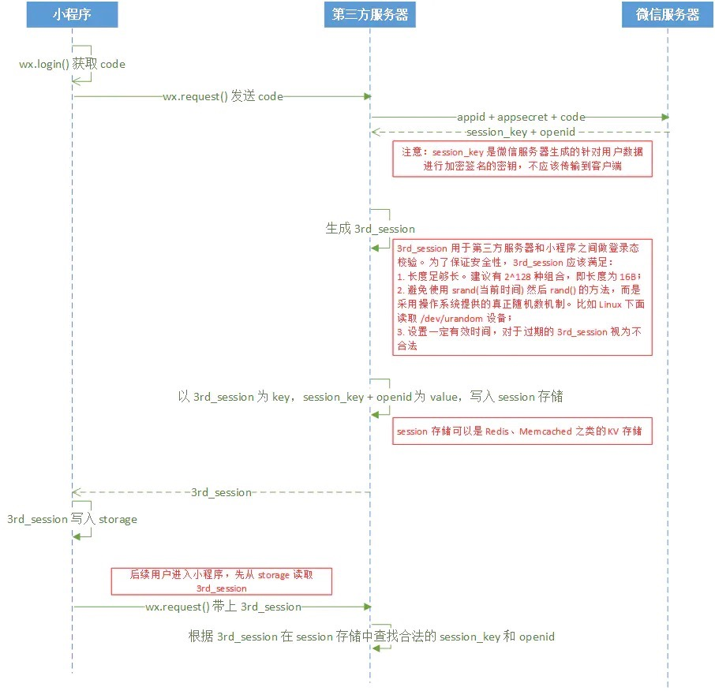

## 1.微信小程序的AppID和AppSecret是什么？如何获得?

AppID为应用ID, AppSecret为应用密钥。公众号和小程序均可以使用AppID和AppSecret调用本接口来获取 [access_token](https://developers.weixin.qq.com/doc/offiaccount/Basic_Information/Get_access_token.html)。AppID和AppSecret可在"微信公众平台-开发-基本配置"页中获得。


## 2.js_code如何获得？
js调用wx.login()接口就可获取登录凭证(js_code)。


## 3.如何获得 session_key 和 openId ?

官方提供了HTTP接口：
```python
f'https://api.weixin.qq.com/sns/jscode2session?appid={APPID}&secret={APPSECRET}&js_code={js_code}&grant_type=authorization_code'
```

只需要在服务器端将 AppID、AppSecret、和 jscode 带入上面url中发送 GET 请求即可获得包含 oppenid、sessionk_key 的json数据。

那么为什么我们要在服务端来请求这个接口呢？其实是出于安全性的考量，如果我们在前端通过request调用此接口，就不可避免的需要将我们小程序的appid和小程序的secret暴露在外部，同时也将微信服务端下发的session_key暴露给“有心之人”，这就给我们的业务安全带来极大的风险。

同时还需要注意两点:
- session_key和微信派发的js_code是一一对应的，同一js_code只能换取一次session_key。每次调用wx.login()，都会下发一个新的js_code和对应的session_key，为了保证用户体验和登录态的有效性，开发者需要清楚用户需要重新登录时才去调用wx.login()

- session_key是有时效性的，即便是不调用wx.login，session_key也会过期，过期时间跟用户使用小程序的频率成正相关，具体时效逻辑由微信维护。开发者只需要调用 wx.checkSession 接口检测当前用户登录态是否有效。


## 4.微信小程序的 openId 和 session_key 是什么？

**openId**
openId：用户唯一标识。即：在公众平台里，用来标识每个用户在订阅号、服务号、小程序这三种不同应用的唯一标识，也就是说每个用户在每个应用的openid都是不一致的(但同一用户，对同一个微信开放平台下的不同应用，UnionID是相同的)。

**session_key**
有了用户标识，我们就需要让该用户进行登录，那么session_key就保证了当前用户进行会话操作的有效性，这个session_key是微信服务端给我们派发的。
官方说明为：session_key是微信服务器生成的针对用户数据进行加密签名的密钥, 不应该传输到客户端。

为了安全方面的原因，请不要直接使用这些信息作为你小程序的用户标识和session标识回传到小程序客户端中去，我们应该在服务器端做一层自己的session，将这个微信账号登录态生成一个session id并维护在我们自己的session机制中，然后把这个session id派发到小程序客户端作为session标识来使用。关于如何在服务器端做这个session机制，我们现在一般采用键值对存储工具来做，比如redis。我们为每个session生成一个唯一的字符串作为键，然后可以将session_key和openid作为值，存入redis中，为了安全，存入的时候还应设置一个超时的时间(一般自身维护的session有效期设置的总比小程序session的短，在小程序session过期前自己的session已经过期了，所以用自身维护的session的来进行会话管理就行了。)。


## 所以，小程序登录鉴权，大概是这样的：

- 前端调用wx.login()接口获取登录凭证js_code。

- 前端将js_code发给后端。

- 后端拿到js_code，加上已有的AppID和AppSecret数据拿到oppenId、session_key

- 后端根据oppenId、session_key 完成用户的注册或登陆(自定义登陆状态)。返回自定义登陆状态。

- 小程序将该登陆状态(3rd_session)存入storage(小程序没有cookie机制)，后续与后端的请求均带上该登陆状态，以完成登陆、鉴权。

图示如下：


